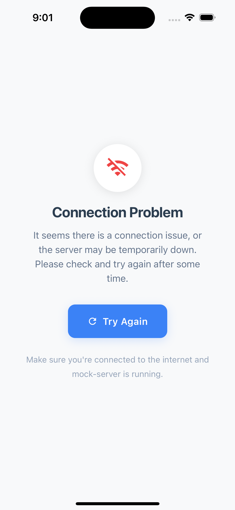
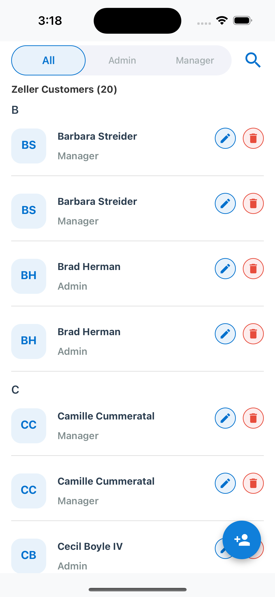
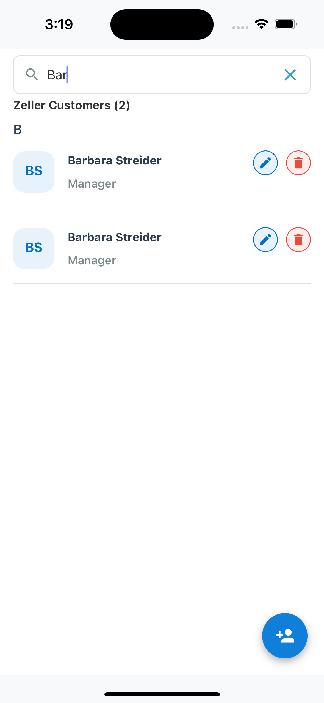
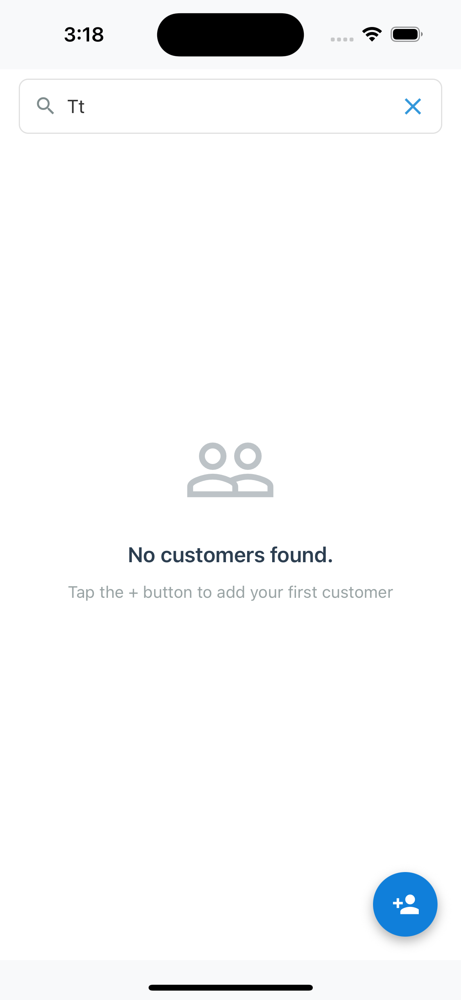
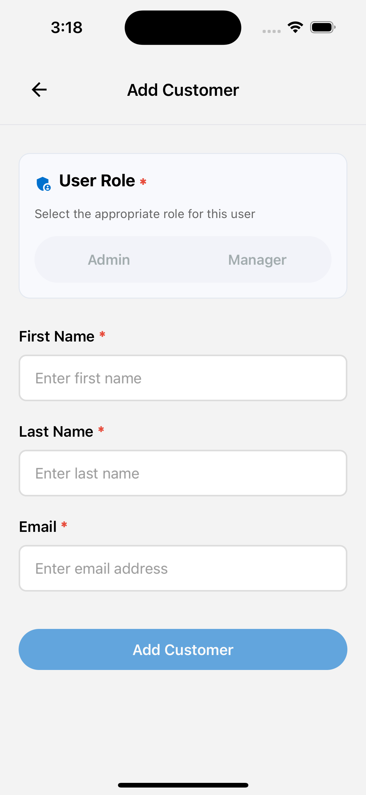
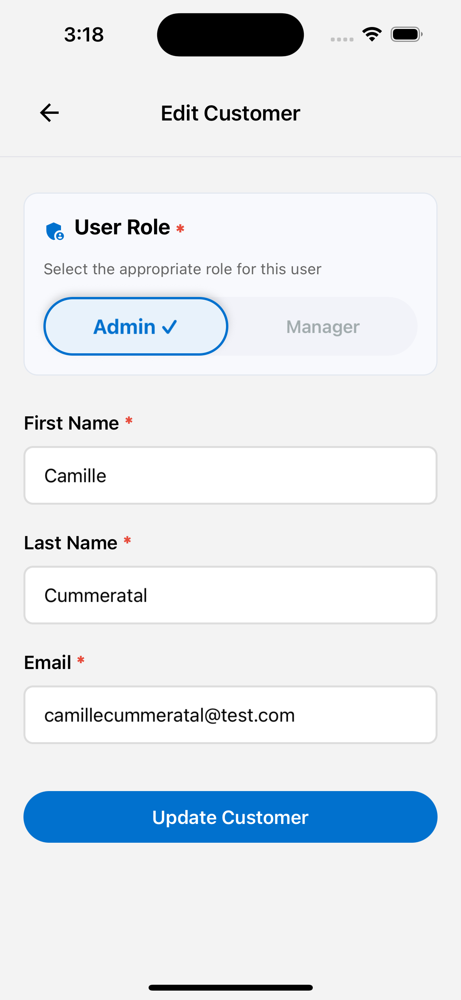
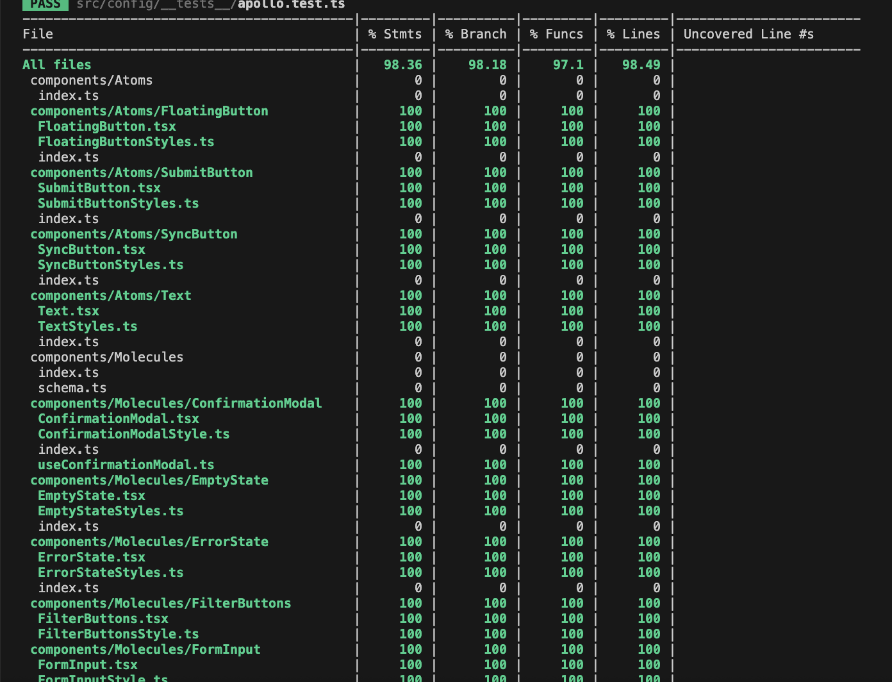

# Zeller RN Code Challenge – Client App

This is a React Native application for the Zeller code challenge.

## Project Overview

This app demonstrates user management with local database persistence (no API mutation required). Users can be added and are stored locally using Realm.

---

## Prerequisites

- **Node.js** (v16 or later recommended)
- **Yarn** (recommended) or npm
- **React Native CLI**
- **Xcode** (for iOS)
- **Android Studio** (for Android)
- **CocoaPods** (for iOS, run `sudo gem install cocoapods` if not installed)

---

## Project Structure

```
zeller-rn-codechallenge/           # Monorepo root
│
├── client-app/                    # Main React Native application
│   ├── src/                       # App source code (components, screens, logic)
│   ├── ios/                       # iOS native project files
│   ├── android/                   # Android native project files
│   └── ...                        # Other client app files (configs, assets, etc.)
│
├── mock-server/                   # Mock API server for development/testing
│   ├── queries/                   # GraphQL query files
│   ├── schema.gql                 # GraphQL schema
│   └── ...                        # Server code and configs
│
├── README.md                      # Monorepo documentation
└── ...                            # Other root-level files
```


## App Setup Instructions

1. **Clone the repository:**
   ```sh
   git clone https://github.com/jazzz-stack/zeller-rn-codechallenge.git
   ```

2. **Install and start the mock server:**
   ```sh
   cd zeller-rn-codechallenge/mock-server
   yarn install
   yarn start
   ```

3. **Navigate to the client app directory:**
   ```sh
   cd ../client-app
   ```

4. **Install dependencies:**
   ```sh
   yarn install
   ```

5. **Install iOS dependencies (Mac only):**
   ```sh
   cd ios && pod install && cd ..
   ```

---

## Running the App

### iOS

```sh
yarn ios
```

### Android

Make sure an Android emulator is running or a device is connected.

```sh
yarn android
```

---

## Start mock-server

Make sure you are running the mock-server if not please follow the steps below.

---

4. **Navigate to mock-server root:**
   ```sh
   zeller-rn-codechallenge > mock-server
   ```

4. **Install dependencies:**
   ```sh
   yarn install
   ```

4. **Start server:**
   ```sh
   yarn start
   ```

---

## Local Database

- The app uses **Realm** for local data storage.
- All new users are saved locally and persist across app reloads.
- No API mutation is performed when adding users.

---

## Running Tests

To run tests and check coverage for the client app, use the following commands from the `client-app` directory:

- **Run all tests:**  
  ```sh
  yarn test
  ```

- **Check total test coverage:**  
  ```sh
  yarn test:coverage
  ```

- **Generate a detailed coverage report (output in the `coverage` directory):**  
  ```sh
  yarn test:coverage:report
  ```

- **Check coverage for a specific file or component:**  
  ```sh
  yarn test:coverage:file <ComponentName>
  ```

- **Run tests for a specific file or component:**  
  ```sh
  yarn test <ComponentName>
  ```

**Examples:**
```sh
yarn test:coverage                 # Verify total coverage
yarn test:coverage:report          # Generate coverage report in 'coverage' directory
yarn test:coverage:file HomeScreen # Check coverage for files matching 'HomeScreen'
yarn test HomeScreen               # Run tests for files matching

## Troubleshooting

- If you encounter issues with dependencies, try:
  ```sh
  yarn install
  cd ios && pod install && cd ..
  ```
- For Metro bundler issues, run:
  ```sh
  yarn start --reset-cache
  ```

---

## Contact

For questions or issues, please open an issue on the [GitHub repository](https://github.com/jazzz-stack/zeller-rn-codechallenge.git) or contact the maintainer at [jaswant.raj45@gmail.com](mailto:jaswant.raj45@gmail.com).

---
## App Preview

Below are screenshots of the app in action:
- Each image represents a different screen or feature of the app.
<p align="center">
  
  
  
  
  
  
</p>

---
## Unit test coverage

Below are screenshots of the client-app unit test coverage:

<p align="center">
 
</p>


